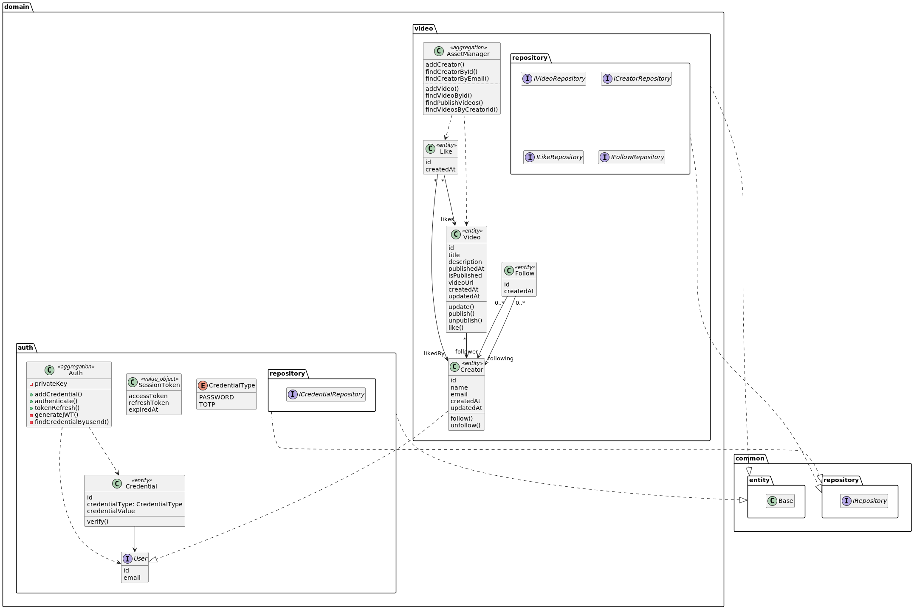

## Getting Started

This project makes use of Yarn Workspaces to be able to share interfaces between the two projects.

### Prerequisites

- Node: `v18.12.0`
- Yarn: `v3.5`
- Docker Compose: `v1.25.0`

To learn how to use this monorepo you can check out [Yarn Workspace Documentation](https://yarnpkg.com/features/workspaces/#gatsby-focus-wrapper).

### Running Locally.

To run the following project locally, you must have a local Postgres instance. You can run the `docker-compose.yml` to easily run such instance. To do so, follow the next steps:

1. Make sure to install the indicated Docker Compose version specified in the Prerequisites section.
2. Run `yarn install` to install all project's dependencies.
3. At the project's backend (located at `./packages/backend/`), create an `.env` file with the following values:
```dotenv
POSTGRES_USER=postgres
POSTGRES_PASSWORD=postgres
POSTGRES_DB=nicasource
POSTGRES_HOST=localhost
POSTGRES_PORT=5432
```
4. Run the following command: `yarn run backend-dev`. This command will: Call `docker-compose`, run migrations on the backend, and call Nodemon in order to start `dev` mode.

## Domain Driven Approach



The following UML diagram represents a video sharing application and can be interpreted using Domain-Driven Design (DDD) concepts. Here's what the diagram tells us:

### Aggregates

- The `AssetManager` class is an aggregate root that manages videos, creators, likes, and follows. It ensures the consistency of the data within its aggregate and controls access to the entities within its aggregate.

### Entities

- The `Video`, `Like`, `Follow`, and `Creator` classes represent entities that have a unique identity and lifecycle. They have attributes that describe their state, and methods that operate on their state.

### Value Objects

- The `SessionToken` class is a value object that contains an access token and a refresh token. Value objects represent concepts that do not have a unique identity but have attributes that describe their state.

### Repositories

- The `IVideoRepository`, `ICreatorRepository`, `ILikeRepository`, `IFollowRepository`, and `ICredentialRepository` interfaces represent repositories that provide data access for the entities and services in the corresponding domains. Repositories manage the persistence of entities and value objects.

### Relationships

- The relationships between the entities represent the business logic of the video sharing application. For example, the `Video` entity has a many-to-many relationship with the `Creator` entity, meaning that a video can have multiple creators, and a creator can have multiple videos. The `Like` entity has a many-to-one relationship with both the `Creator` and `Video` entities, meaning that a like is associated with a single creator and a single video. The `Follow` entity has a one-to-many relationship with the `Creator` entity, meaning that a creator can have multiple followers.

### Authentication and Authorization

- The `Auth` class manages users and credentials for authentication. The `User` interface represents a user that can be authenticated, and the `Credential` entity represents a user's credential that can be verified. The `SessionToken` value object contains an access token and a refresh token for authorization.

The UML diagram reflects a well-structured domain model that separates concerns and reflects the business logic of the video sharing application.

## Improvements

There are a lot of things that can be improved, but because of the short span of time I was tasked with they could not be done. Some of those things are:

- Transactional Control (I was planning to take the Unit of Work approach).
- Various fixes to UI (and add responsive design).
- Add missing functions to front-end that already exists on the back-end: likes, follows.
- Add more unit tests (I did a few just to test my Domain Services), integration tests.
- Clean and Tidy up the code.
- Bug fixing.

